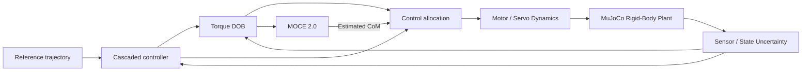

# Palletrone Digital Twin

**Flight-data-driven MuJoCo simulation for model identification, uncertainty characterization, and robustness validation of a fully actuated multirotor UAV.**

This repository contains a ROS 2 / C++17 / MuJoCo simulation environment for the Palletrone fully actuated multirotor platform.  
The current development focus is not only controller reproduction, but also **simulation-fidelity enhancement using real flight data** so that risky center-of-mass (CoM)-biased payload experiments can be evaluated in simulation before hardware testing.

---

## 1. Project Objective

Ideal rigid-body simulation tends to produce substantially cleaner tracking and disturbance-estimation behavior than the real vehicle.  
The goal of this project is therefore to construct a simulation model whose dominant physical and stochastic uncertainties are grounded in real flight data.

The overall workflow is:

```text
Real Flight Data
      |
      +--> Rigid-Body Identification
      |      - Mass
      |      - Moment of inertia
      |      - CoM / payload geometry
      |      - Thrust effectiveness
      |
      +--> Actuator Dynamics Identification
      |      - Effective delay
      |      - First-order response
      |      - Motor / servo command-to-response mismatch
      |
      +--> Measurement Uncertainty
      |      - Hover residual analysis
      |      - Position / velocity / attitude / gyro uncertainty
      |
      +--> Residual Dynamics Modeling
             - Unmodeled equivalent wrench
             - Variance / autocorrelation / PSD
             - White or colored stochastic disturbance
                    |
                    v
              MuJoCo Digital Twin
                    |
                    v
            Real-vs-Sim Validation
                    |
                    v
             Monte Carlo Testing
```

The final target is a **model → identify → validate → stress-test** workflow for evaluating MOCE-based CoM adaptation under payload and model uncertainty.

---

## 2. System Overview

- **Middleware:** ROS 2 Humble
- **Simulation:** MuJoCo
- **Implementation:** C++17
- **Controller:** Cascaded position / velocity / attitude / body-rate control
- **Disturbance estimation:** Torque disturbance observer (DOB)
- **Adaptive geometry:** MOCE 2.0 CoM estimation and allocation update
- **Vehicle:** Fully actuated multirotor with four tilting rotor modules
- **Logging / analysis:** MATLAB-compatible CSV



---

# 3. Flight-Data-Driven Model Identification

## 3.1 Rigid-Body Identification

### 3.1.1 Mass

Vehicle and payload masses are measured directly using a scale rather than treated as free optimization variables.

\[
m = m_{\mathrm{vehicle}} + m_{\mathrm{payload}}
\]

The configuration separates unloaded vehicle mass and payload mass:

```yaml
model:
  vehicle_mass: 4.2

  payload:
    mass: 0.5
```

---

### 3.1.2 Payload Geometry and Center of Mass

For a payload located at \(\mathbf r_p\), the payload-induced CoM offset is

\[
\mathbf r_{\mathrm{CoM}}
=
\frac{m_p \mathbf r_p}
     {m_v + m_p}
\]

when the unloaded vehicle reference CoM is placed at the base origin.

The simulator deliberately separates

- **physical CoM generated by mass geometry**, and
- **initial CoM estimate used by MOCE**.

```yaml
model:
  payload:
    mass: 0.5
    # FRD measurement [0.31, -0.31, -0.56] converted with [x, -y, -z]
    position: [0.31, 0.31, 0.56] # FLU

  initial_com_estimate: [0.0, 0.0, 0.0]
```

This separation allows an intentionally biased estimator prior while preserving the true plant geometry.

---

### 3.1.3 Moment of Inertia

The effective rigid-body inertia is identified from flight logs using rotational dynamics:

\[
\boldsymbol{\tau}
=
\mathbf J \dot{\boldsymbol{\omega}}
+
\boldsymbol{\omega}
\times
\mathbf J \boldsymbol{\omega}
\]

where

- \(\boldsymbol{\omega}\): measured body angular velocity,
- \(\dot{\boldsymbol{\omega}}\): angular acceleration,
- \(\boldsymbol{\tau}\): body torque command / reconstructed torque,
- \(\mathbf J\): rigid-body inertia.

For the principal-axis approximation,

\[
\mathbf J =
\mathrm{diag}(J_x, J_y, J_z)
\]

and the equations can be written as a linear regression:

\[
\mathbf y_k = \mathbf \Phi_k \boldsymbol{\theta},
\qquad
\boldsymbol{\theta}
=
\begin{bmatrix}
J_x & J_y & J_z
\end{bmatrix}^{T}
\]

The stacked least-squares estimate is

\[
\hat{\boldsymbol{\theta}}
=
\arg\min_{\boldsymbol{\theta}}
\left\|
\mathbf y-\mathbf \Phi \boldsymbol{\theta}
\right\|_2^2
\]

which can be solved in MATLAB using

```matlab
J_hat = Phi \ y;
```

Raw gyro differentiation should not be used directly because differentiation amplifies measurement noise.  
The practical processing sequence is:

```text
Gyro
  -> Low-pass / Savitzky-Golay filtering
  -> Numerical differentiation
  -> Angular acceleration
  -> Least-squares rigid-body identification
```

The controller/DOB/MOCE nominal rigid-body approximation is

```yaml
model:
  nominal_inertia: [0.0768, 0.0871, 0.113]
```

in kg m^2.

> **Implementation note:** controller/DOB nominal inertia and the MuJoCo plant's physical payload-dependent inertia should remain conceptually separated. Payload parallel-axis effects belong to the physical plant model, while the DOB/MOCE nominal model should reproduce the inertia approximation used on the real controller.

The preliminary unloaded-assembly identification is

```text
J_unloaded = diag([0.110, 0.072, 0.083]) kg m^2.
```

The four rotor centers at zero tilt are at
`[+/-0.148492, +/-0.148492, 0.0233388] m`. With each rotor having mass
`0.2 kg` and intrinsic inertia `diag([0.0003, 0.0003, 0.0003]) kg m^2`, their
combined contribution about the unloaded assembly origin is
`[0.019275659, 0.019275659, 0.036479799] kg m^2`. The remaining `3.4 kg`
base body has its own CoM at `[0, 0, -0.005491482] m`; its parallel-axis
contribution is `[0.000102532, 0.000102532, 0] kg m^2`. Therefore the
configured base-body inertia about its own CoM is

```text
[0.110, 0.072, 0.083]
- [0.019275659, 0.019275659, 0.036479799]
- [0.000102532, 0.000102532, 0]
= [0.090621809, 0.052621809, 0.046520201] kg m^2.
```

The payload remains a separate physical mass contribution in the compiled
MuJoCo base inertial, so it is not included in this configured value.

---

### 3.1.4 Thrust Effectiveness

Nominal rotor thrust is modeled as

\[
T_i = k_f \omega_i^2
\]

while the actual thrust is represented by

\[
T_{i,\mathrm{actual}}
=
\eta_i T_{i,\mathrm{nominal}}
\]

where \(\eta_i\) is the thrust effectiveness.

The current simulator supports per-rotor scaling:

```yaml
motor:
  thrust_scale: [0.688, 0.688, 0.688, 0.688]
```

A common value represents common-mode thrust mismatch. The previous baseline
is reproduced by setting all four values back to `0.67`.
Unequal values can later represent rotor-to-rotor asymmetry:

\[
\eta_i = \bar{\eta} + \Delta\eta_i
\]

### 3.1.5 Slow Common-Mode Thrust-Effectiveness Drift

The deterministic v2 plant adds the flight-log-identified operating-condition-dependent
common effectiveness

```text
eta_common(t) = clamp(0.6966 - 0.000844 t, 0.63, 0.70).
T_actual_i = eta_common(t) * eta_relative_i * T_nominal_i.
```

The available logs do not contain battery voltage, so this is deliberately not described as a
battery-voltage-sag model. The cause may involve battery, temperature, or other operating
conditions, but is not identifiable from the current data.

`t` starts at the first nonzero nominal thrust command. Time spent with only the viewer running
does not age the model. Effectiveness and the relative per-rotor multiplier are applied before the
existing motor transport delay and first-order lag; no additional dynamic filter is introduced.

The exact historical baselines are preserved as `model_identified_v1.yaml`,
`model_identified_v2_drift.yaml`, and `model_identified_v3_measurement.yaml`. The default
`model.yaml` is v4. All versions use `control.yaml` except v1, which uses
`control_identified_v1.yaml` to preserve its absolute `[0.688, 0.688, 0.688, 0.688]` scaling.

The simulator CSV keeps legacy `data[0]` through `data[92]` unchanged and appends
`eta_common` at `data[93]` and the four actual thrust scales at `data[94:97]`.
Raw MuJoCo acceleration and angular acceleration are appended at `data[98:100]` and
`data[101:103]`; the legacy noisy finite-difference channels remain unchanged.
The v4 physical OU torque and total external body torque are appended at `data[104:106]` and
`data[107:109]`.

### 3.1.6 Colored Physical Torque Residual

V4 adds an axis-independent Ornstein-Uhlenbeck body-torque process after the actuator dynamics.
For each axis it uses the exact discrete update

```text
a = exp(-dt / tau)
d[k+1] = a d[k] + sigma sqrt(1-a^2) N(0,1).
```

The process starts with the first nonzero thrust command and is initialized from its stationary
distribution. It is transformed from body FLU to world coordinates before the existing MuJoCo
external-wrench application. The applied body torque is explicitly
`configured_constant_torque + OU_torque`; no clipping or force residual is used.

The mandatory first physical guess was `[0.163, 0.108, 0.056] Nm` with correlation times
`[0.60, 0.71, 0.94] s`. It over-predicted Complete-window DOB variance. Gray-box refinement using
only DOB-output STD and correlation statistics produced the v4 setting stored in `model.yaml`.
These physical-input values are calibration parameters and are not claimed to equal measured DOB
output statistics or uniquely identified physical truth.

---

## 3.2 Actuator Dynamics Identification

**Status: in progress**

Once the dominant rigid-body parameters are identified, the remaining command-to-response mismatch is analyzed as effective actuator dynamics.

The rigid-body torque reconstructed from the measured motion is

\[
\boldsymbol{\tau}_{\mathrm{rb}}
=
\mathbf J \dot{\boldsymbol{\omega}}
+
\boldsymbol{\omega}
\times
\mathbf J \boldsymbol{\omega}
\]

and is compared with the commanded torque.

Instead of assuming an instantaneous actuator, the first model candidate is a **First-Order Plus Dead-Time (FOPDT)** model:

\[
G_a(s)
=
\frac{K_a}{\tau_a s+1}
e^{-T_d s}
\]

with

- \(K_a\): effective actuator gain,
- \(\tau_a\): first-order time constant,
- \(T_d\): effective delay.

Thus,

\[
\boldsymbol{\tau}_{\mathrm{act}}(s)
=
G_a(s)\boldsymbol{\tau}_{\mathrm{cmd}}(s)
\]

and the identification problem becomes

\[
\min_{K_a,\tau_a,T_d}
\sum_k
\left\|
\boldsymbol{\tau}_{\mathrm{rb},k}
-
\boldsymbol{\tau}_{\mathrm{act},k}
\right\|_2^2
\]

### Delay Initialization

Cross-correlation can be used to obtain an initial estimate of effective delay:

```matlab
[c, lags] = xcorr(tau_rb, tau_cmd, 'normalized');
[~, idx] = max(c);

Td0 = lags(idx) * Ts;
```

The resulting parameters are reflected in:

```yaml
model:
  motor:
    delay_s: ...
    time_constant_s: ...

  servo:
    delay_s: ...
```

When motor RPM or measured servo angle is unavailable, the identified dynamics are treated as **effective command-to-body dynamics**, rather than falsely claiming independent identification of ESC, motor, propeller, servo, and estimator delays.

---

## 3.3 Measurement Uncertainty

**Status: planned**

The full variance of a hovering flight signal is **not** directly copied into the simulator as sensor noise because it also contains true vehicle motion, controller oscillation, actuator vibration, and environmental disturbance.

Instead, a quasi-stationary hover interval is selected and decomposed as

\[
y(t) = x(t) + n(t)
\]

where the low-frequency component approximates the physical motion:

\[
\hat{x}(t) = LPF(y(t))
\]

and the high-frequency residual is

\[
r(t) = y(t) - \hat{x}(t)
\]

The uncertainty level is then estimated from the residual:

\[
\sigma_r = \mathrm{std}(r)
\]

or, for robust estimation,

\[
\sigma_{\mathrm{MAD}}
=
1.4826
\operatorname{median}
\left(
|r-\operatorname{median}(r)|
\right)
\]

The procedure is applied independently to

- position,
- velocity,
- attitude,
- angular velocity.

The identified values will populate:

```yaml
model:
  sensors:
    position_std: [...]
    velocity_std: [...]
    attitude_std: [...]
    gyro_std: [...]
```

A steady-state tracking offset is not automatically interpreted as sensor bias.  
Bias identification requires either an independent ground truth source or an explicitly defined bounded estimator uncertainty model.

---

## 3.4 Residual Dynamics Modeling

**Status: planned**

After rigid-body parameters, actuator dynamics, and measurement uncertainty have been modeled, the remaining unexplained torque is treated as an **equivalent unmodeled disturbance**.

Using the identified actuator model,

\[
\boldsymbol{\tau}_{\mathrm{model}}
=
G_a(s)\boldsymbol{\tau}_{\mathrm{cmd}}
\]

and the measured rigid-body response,

\[
\boldsymbol{\tau}_{\mathrm{rb}}
=
\mathbf J\dot{\boldsymbol{\omega}}
+
\boldsymbol{\omega}\times\mathbf J\boldsymbol{\omega}
\]

the residual torque is defined as

\[
\mathbf d_\tau(t)
=
\boldsymbol{\tau}_{\mathrm{rb}}(t)
-
\boldsymbol{\tau}_{\mathrm{model}}(t)
\]

This residual may contain effects such as

- aerodynamic disturbance,
- rotor asymmetry,
- unmodeled servo behavior,
- structural vibration,
- flexible dynamics,
- estimator/controller mismatch.

The residual is characterized using:

1. mean,
2. variance / covariance,
3. histogram,
4. autocorrelation,
5. power spectral density (PSD).

### White Residual

If temporal correlation decays almost immediately,

\[
\mathbf d_\tau
\sim
\mathcal N(\boldsymbol{\mu}_d,\mathbf \Sigma_d)
\]

can be used as a white stochastic disturbance.

### Correlated Residual

If substantial temporal correlation remains, a first-order Gauss-Markov model is used:

\[
\mathbf d_{k+1}
=
\mathbf A_d \mathbf d_k
+
\mathbf w_k
\]

with

\[
a_i = e^{-\Delta t/\tau_{d,i}}
\]

for an axis-wise first-order model.

This prevents all remaining real-flight mismatch from being incorrectly absorbed into measurement white noise.

---

# 4. Real-vs-Simulation Validation

Real and simulated logs are aligned using the **MOCE activation event**, rather than a hard-coded logging time.

The MATLAB analysis script uses the MOCE enable flag in the CSV to define a common experiment time origin:

```matlab
moce_enabled = values(:,66);

idx_moce = find(diff(moce_enabled > 0.5) == 1, 1, 'first') + 1;

moce_start_time = time(idx_moce);

% Real-flight convention: MOCE activation occurs at evaluation t = 5 s
metric_start_time = moce_start_time - 5.0;
```

The common evaluation windows are:

| Window | Time | Purpose |
|---|---:|---|
| Overall | 0-80 s | Full evaluation |
| Transient 1 | 5-60 s | MOCE adaptation interval |
| Transient 2 | 20-60 s | Trajectory + adaptation transient |
| Complete | 60-80 s | Converged/post-adaptation behavior |

Metrics include:

- RMS position-error norm,
- axis-wise position RMS,
- RMS attitude-error norm,
- axis-wise roll/pitch/yaw RMS,
- peak attitude error,
- angular-acceleration-command norm,
- DOB disturbance-estimate magnitude,
- CoM convergence.

The objective is **not to force every scalar metric to match exactly**, but to reproduce the dominant response bandwidth, error scale, disturbance level, and adaptation behavior of the real platform.

---

# 5. Monte Carlo Robustness Validation

**Status: planned**

After nominal identification and validation, uncertainty distributions are sampled across repeated simulation trials.

Candidate uncertain parameters include:

\[
J_i,\quad
\eta_i,\quad
T_d,\quad
\tau_a,\quad
\mathbf r_{\mathrm{CoM}},\quad
\mathbf d_\tau,\quad
\text{sensor uncertainty}
\]

Example:

\[
J_i
\sim
\mathcal N(\hat J_i,\sigma_{J_i}^{2})
\]

\[
\eta_i
\sim
\mathcal N(\hat\eta_i,\sigma_{\eta_i}^{2})
\]

Each trial records:

- position RMS,
- attitude RMS,
- maximum attitude error,
- CoM convergence error,
- convergence time,
- actuator saturation,
- instability / crash condition.

A basic success metric is

\[
P_{\mathrm{success}}
=
\frac{N_{\mathrm{success}}}
     {N_{\mathrm{trial}}}
\]

This stage will be used to evaluate whether a CoM-biased payload experiment is sufficiently robust before hardware testing.

---

# 6. Current Development Status

| Item | Status |
|---|---|
| ROS 2 / MuJoCo Palletrone simulator | Done |
| Cascaded controller | Done |
| Torque DOB | Done |
| MOCE 2.0 adaptation | Done |
| Automated experiment sequence | Done |
| MATLAB-compatible CSV logging | Done |
| Event-based real/sim time alignment | Done |
| Mass measurement | Done |
| Rigid-body inertia identification | Done / refining validation |
| Thrust-effectiveness correction | Implemented |
| Effective actuator dynamics identification | In progress |
| Measurement uncertainty identification | Planned |
| Residual disturbance modeling | Planned |
| Monte Carlo robustness evaluation | Planned |

---

# 7. Build and Run

From the ROS 2 workspace root:

```bash
source /opt/ros/humble/setup.bash

colcon build --symlink-install \
  --cmake-args -DCMAKE_BUILD_TYPE=RelWithDebInfo

source install/setup.bash

ros2 launch palletrone_cmd pt_launch.py
```

Run the command node in another terminal:

```bash
source /opt/ros/humble/setup.bash
source install/setup.bash

ros2 run palletrone_cmd command_node
```

Key commands:

| Key | Action |
|---|---|
| `W / S` | World +X / -X |
| `A / D` | World +Y / -Y |
| `E / Q` | +Z / -Z |
| `Z / C` | Yaw |
| `G` | Start / stop Lissajous trajectory |
| `P` | Toggle MOCE |
| `M` | Run automated experiment |
| `H` | Hold measured pose |
| `X` | Reset / cancel |
| `T` | Exit command node |

Headless execution:

```bash
ros2 launch palletrone_cmd pt_launch.py viewer:=false
```

Disable logging:

```bash
ros2 launch palletrone_cmd pt_launch.py logging:=false
```

Select custom configurations:

```bash
ros2 launch palletrone_cmd pt_launch.py \
  control_config:=/absolute/control.yaml \
  model_config:=/absolute/model.yaml \
  command_config:=/absolute/command.yaml
```

---

# 8. Configuration

Three YAML files separate controller, physical model, and command settings.

### Controller

```text
src/palletrone_interfaces/config/control.yaml
```

Contains:

- position / velocity / attitude / rate gains,
- DOB settings,
- MOCE gains,
- allocator parameters,
- thrust-effectiveness scaling,
- simulated inner servo gains.

### Physical Model

```text
src/palletrone_interfaces/config/model.yaml
```

Contains:

- vehicle / payload mass,
- payload position,
- plant and nominal inertia,
- rotor geometry,
- motor dynamics,
- servo dynamics,
- sensor uncertainty,
- external disturbance,
- simulation rates.

### Command / Experiment

```text
src/palletrone_interfaces/config/command.yaml
```

Contains:

- keyboard commands,
- automated experiment timing,
- Lissajous trajectory,
- command bounds,
- visualization settings.

---

# 9. Torque DOB and MOCE 2.0

The simulator reproduces the torque DOB and CoM adaptation structure used in the Palletrone PX4 implementation.

Reference PX4 repository:

- [SEOSUK/PX4-Modifying](https://github.com/SEOSUK/PX4-Modifying)
- Reference revision: `36300ac08efa6c11ef76679142dff7d12722ccfd`

For each axis, the DOB uses

\[
Q(s)
=
\frac{\omega_c^2}
{s^2+\sqrt{2}\omega_c s+\omega_c^2}
\]

and the CoM estimator uses the disturbance-torque residual together with the filtered force regressor.

Current MOCE gains corresponding to the real-flight implementation are:

```yaml
moce:
  gamma: [7.0e-6, 7.0e-6, 2.2e-4]
```

---

# 10. Logging and MATLAB Analysis

The CSV logger writes MATLAB-compatible files under

```text
src/palletrone_interfaces/bag/
```

with the legacy layout

```text
time, layout.data_offset, data[0], ..., data[92]
```

The MATLAB logger extracts, among other signals:

- measured / desired position,
- measured / desired attitude,
- body angular velocity,
- desired body torque,
- torque DOB estimate,
- CoM estimate,
- MOCE enable state.

Typical analysis:

```matlab
palletrone_logger
```

The analysis produces quantitative metrics and comparison figures for trajectory tracking, DOB response, attitude regulation, desired torque, and CoM convergence.

---

# 11. Repository Structure

```text
Sim_palletrone/
├── README.md
├── src/
│   ├── palletrone_cmd/
│   │   └── command / experiment generation
│   │
│   ├── palletrone_controller/
│   │   └── cascaded controller, DOB, MOCE, allocator
│   │
│   ├── palletrone_interfaces/
│   │   ├── config/
│   │   ├── msg/
│   │   └── bag/
│   │
│   ├── palletrone_visualization/
│   │   └── RViz / URDF visualization
│   │
│   └── plant/
│       └── native MuJoCo plant
│
└── ...
```

---

# 12. Validation Tests

```bash
colcon test \
  --packages-select palletrone_controller plant \
  --event-handlers console_direct+

colcon test-result --verbose
```

The simulator tests controller algorithms and native MuJoCo behavior, including:

- DOB filter behavior,
- disturbance rejection,
- MOCE convergence,
- CoM allocation,
- actuator / sensor delays,
- saturation and reset behavior,
- physical parameter application,
- Lissajous tracking.

---

# 13. Engineering Focus

This project intentionally avoids treating simulation fidelity as manual tuning.

The target methodology is:

1. **Measure what can be measured directly.**
2. **Identify deterministic dynamics from flight data.**
3. **Characterize measurement uncertainty from residuals rather than raw variance.**
4. **Model remaining unexplained dynamics explicitly as residual disturbances.**
5. **Validate against flight metrics not used only for parameter fitting.**
6. **Use the resulting uncertainty model for Monte Carlo robustness assessment.**

The resulting simulator is intended as an engineering tool for reducing risk before aggressive payload and CoM-variation flight tests.
