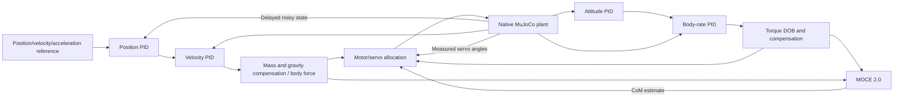

# Palletrone Simulator

ROS 2 Humble / C++17 / MuJoCo. The native `plant` executable runs both physics and the GLFW viewer; Python is used only for the ROS launch description and, optionally, SDK discovery during CMake configuration.

## Build and run

From the workspace root:

```bash
source /opt/ros/humble/setup.bash
colcon build --symlink-install --cmake-args -DCMAKE_BUILD_TYPE=RelWithDebInfo
source install/setup.bash
ros2 launch palletrone_cmd pt_launch.py
```

The default launch starts MuJoCo, both controllers, the URDF bridge, and RViz. ROS launch does not attach stdin to a node. The built-in command publisher is disabled by default so it cannot compete with a separate keyboard node on `/cmd`. Run the command node in its own terminal:

```bash
# Terminal 1
ros2 launch palletrone_cmd pt_launch.py

# Terminal 2
source /opt/ros/humble/setup.bash
source install/setup.bash
ros2 run palletrone_cmd command_node
```

Press `W/S` for world ±X, `A/D` for world ±Y, `E/Q` for ±Z, `Z/C` for yaw, and `G` to start or stop the Lissajous curve. `P` toggles MOCE adaptation, `H` holds the measured pose, `X` resets the command, and `T` exits the command node. Keys are case-insensitive. When stdin is unavailable, the same input can be sent as a one-character `std_msgs/String` on `/command/key`.

Press `M` to run the controlled experiment configured under `command.automated_experiment`: a smooth ascent to 0.7 m, 30 seconds of hover, X/Y MOCE activation at hover second 15, 60 seconds of analytical Lissajous tracking, then hover again at `[0, 0, 0.7]`. MOCE is forced off when the sequence starts and remains on after its scheduled activation. Movement/yaw keys and `G` are ignored during the sequence; `H` or `X` cancels it.

While Lissajous is active, movement and yaw keys are ignored by default. Press `G` again to hold the current trajectory command and resume manual control from that position. `H`, `X`, and `P` remain available during the curve. Set `command.manual_cancels_trajectory: true` to opt into cancelling the curve with a movement/yaw key. Command status is printed once for each recognized key input.

The build needs Eigen3, yaml-cpp, GLFW3, OpenGL, and the MuJoCo C/C++ SDK. CMake first tries `find_package(mujoco)`, then `-DMUJOCO_ROOT=/path/to/sdk`, and finally discovers the SDK shipped in an installed `mujoco` Python wheel. The resulting executable links directly to `libmujoco`; it does not embed or launch Python.

```bash
# Run without a graphics window:
ros2 launch palletrone_cmd pt_launch.py viewer:=false
# Enable the built-in reference publisher for /command/key topic input:
# Use this instead of running a separate command_node.
ros2 launch palletrone_cmd pt_launch.py command:=true
# Disable RViz and/or all ROS visualization nodes:
ros2 launch palletrone_cmd pt_launch.py rviz:=false visualization:=false
# Disable CSV flight logging or choose another output directory:
ros2 launch palletrone_cmd pt_launch.py logging:=false
ros2 launch palletrone_cmd pt_launch.py log_directory:=/absolute/output/directory
# Select alternative experiment configurations:
ros2 launch palletrone_cmd pt_launch.py control_config:=/absolute/control.yaml model_config:=/absolute/model.yaml command_config:=/absolute/command.yaml
```

If converting an old non-symlink/Python build, move the old `build` and `install` directories aside before rebuilding. Package `plant` now uses `ament_cmake`.

## Configuration

Three YAML files separate controller, model, and operator-command settings:

- [`src/palletrone_interfaces/config/control.yaml`](src/palletrone_interfaces/config/control.yaml): position, velocity, attitude, and rate PID gains; integral/output limits; derivative filters; DOB/MOCE gains and enable flags; allocation settings; simulated servo position gains.
- [`src/palletrone_interfaces/config/model.yaml`](src/palletrone_interfaces/config/model.yaml): unloaded vehicle mass, payload mass and position, component/nominal inertias, estimator prior, geometry, gravity, initial pose, actuator parameters, sensor noise and delays.
- [`src/palletrone_interfaces/config/command.yaml`](src/palletrone_interfaces/config/command.yaml): every key binding, XYZ/yaw tick, command rates and bounds, startup command, Lissajous amplitude/frequency/phase/period/repeat behavior, and visualization frames/topics/styles.

These are application YAML files, not ROS `ros__parameters` files. Nodes expose the corresponding `control_config`, `model_config`, and `command_config` path parameters and read the files at startup. Restart the affected node after editing them. With `--symlink-install`, edits in the source config directory also affect the installed defaults.

## Control and feedback



The position PID produces a world-frame velocity setpoint. The velocity PID produces acceleration; mass scaling and gravity feedforward produce a body-frame force command. Attitude error is the shortest quaternion rotation expressed in the current body frame. The attitude PID produces body-rate setpoints, and the rate PID produces torque in Nm. Every PID has an integral limit, conditional integration at its output limit, a filtered derivative on measurement, and output saturation. Velocity/acceleration and angular-rate feedforward fields are available in `Cmd.msg`. The default attitude target is level with zero yaw.

Control updates run once per sensor sample, using its acquisition timestamp. The configured trajectory is `x=0.15 sin(2π·0.30t)`, `y=0.35 sin(2π·0.15t)`, and `z=-0.775+0.075 cos(2π·0.60t)`. The command node publishes its analytical velocity and acceleration feedforward. Stopping the curve holds its last position.

## Torque DOB and MOCE 2.0

The implementation follows these files in [SEOSUK/PX4-Modifying](https://github.com/SEOSUK/PX4-Modifying/tree/36300ac08efa6c11ef76679142dff7d12722ccfd/src/modules/mc_rate_control):

- `torque_disturbance_observer.cpp`
- `dob_based_com_estimator.cpp`
- The rate-PID/DOB/MOCE wiring in `MulticopterRateControl.cpp` and CoM updates in `control_allocator/ControlAllocator.cpp`.

The reference revision is `36300ac08efa6c11ef76679142dff7d12722ccfd`. The algorithms are reimplemented using Eigen with per-instance filter states.

For each axis, the DOB uses `Q(s) = wc² / (s² + sqrt(2)*wc*s + wc²)` and estimates `d_hat = J * sQ(s) * omega - Q(s) * effective_torque`. The command is `tau_rate_PID + omega × (J omega) - d_hat` when compensation is enabled. The known gyroscopic term is removed from the observer input. The cutoff is configured in **rad/s**, matching the PX4 source. The source's forward-Euler filters are replaced by exact zero-order-hold discretization of the same continuous-time filter. Estimate and final torque limits are explicit.

MOCE uses the reference law `c_dot = Gamma * (J^-1 * skew(QF))^T * d_hat`, with force in N and the source DOB signal in Nm. In the simulator's FLU coordinates, the geometric residual is `skew(F) * (c_true - c_est)`, so the positive adaptation sign estimates the physical CoM offset. The raw bounded estimate updates **all three** moment-arm components in the allocator; the LPF estimate is published for logging, matching the reference's use of raw CoM in allocation. The original adaptation gains are retained in YAML.

`dob.enabled`, `dob.compensate`, and `moce.enabled` are independent. `moce.enabled` selects the initial runtime state; the `P` key can enable or disable MOCE during flight regardless of that initial value. In the automated `M` sequence, X/Y estimation starts 15 seconds into hover and Z estimation joins when the Lissajous trajectory starts. MOCE can continue observing when torque compensation is disabled. Ground-contact learning is gated by height, and vertical CoM learning additionally requires sufficient horizontal force. A prolonged sample gap or backwards simulation time resets the controller/estimators. Constant external torque can bias a CoM estimate; the observer measures a lumped residual, not a unique physical classification of the disturbance.

## Allocation and model conventions

World coordinates are Z-up; body coordinates are FLU. The true CoM is no longer configured directly. `vehicle_mass` is the unloaded assembly mass, including four rotors; `payload.mass` and `payload.position` define the rigid payload. Total mass, neutral total CoM, and diagonal parallel-axis inertia terms are derived from them. `initial_com_estimate` remains only the MOCE prior.

Allocation first solves motor thrust from roll/pitch moments, reaction-yaw moment, and vertical force at the **measured** tilt. A second solve produces `sin(theta)` for lateral force and geometric-yaw torque; `asin` converts it to a servo target. Rotor moment columns are constructed from `(rotor_position - estimated_com) × thrust_direction` plus reaction torque. Motor thrust and servo commands are bounded. Saturation can leave a wrench residual; the allocator does not guarantee an infeasible requested wrench.

The default **servo range is ±0.7 rad** in MJCF joint limits, actuator targets, allocator saturation, and URDF joint limits. The MJCF explicitly selects radians. Each tilt hinge rotates its `PROP.stl` mesh and thrust site together. RViz receives the measured four servo angles through `/joint_states`, so the URDF propeller assemblies reproduce the simulated tilting motion.

RViz uses `world -> palletrone_pose -> base_link` for the measured vehicle pose and `world -> command_pose` for the reference. The red/orange sphere is the MOCE estimate, and the true-CoM sphere is computed from truth servo angles. The bright green payload cuboid is placed at `payload.position`; its XYZ dimensions are configured by `visualization.marker.payload_dimensions`. MuJoCo shows the same location with its green `payload_marker` site. The display setup is stored in [`src/palletrone_visualization/rviz/palletrone.rviz`](src/palletrone_visualization/rviz/palletrone.rviz).

`visualization.marker.com_distance_scale` multiplies the estimated and true CoM marker offsets from `base_link` (default: 5). This affects only their displayed positions; sphere diameters, payload position, TF, and physical CoM values retain their original scale.

The launch starts `csv_logger` by default and writes `MMDDHHMM.csv` files under `src/palletrone_interfaces/bag` when using the symlink install. Each row follows the supplied 95-column `time,layout.data_offset,data[0]...data[92]` layout, so `Exp_3_logger.m` reads position, reference, attitude, torque, DOB, and filtered CoM from the same fixed columns. Time is relative nanoseconds from the first logged controller sample. If another launch starts within the same minute, it appends to that minute's file rather than erasing it.

The C++ model applies YAML masses, inertias, CoM, geometry, gains, and limits to `mjSpec` **before compilation** and the first step (so MuJoCo recomputes inertial-frame optimizations). It uses the implicit-fast integrator. MuJoCo joint limits are soft constraints, so small physical overshoots can occur although commanded angles are clamped.

Motor and servo delay lines are separate; motor thrust can additionally have a configurable first-order lag. Sensor noise is sampled before the common sensor transport delay. Simulation stepping, delay queues, and timestamps use simulation time. A stale actuator stream produces zero thrust and neutral servo commands. Noise has a reproducible configurable seed. `model.disturbance` injects world force at the assembly CoM and body-frame torque during the configured interval.

`motor.thrust_scale` in `control.yaml` applies a per-rotor MuJoCo thrust loss after the allocator's nominal command. The default `[0.67, 0.67, 0.67, 0.67]` implements `thrust_actual = 0.67 * thrust_nominal`; unequal values can model rotor-to-rotor differences. The reaction-yaw torque scales with the same actual thrust.

## Topics

| Topic | Contents |
|---|---|
| `/cmd` | Position, velocity/acceleration feedforward, desired RPY and body rate |
| `/palletrone_state` | Delayed noisy state, servo measurements, acquisition time |
| `/palletrone_truth` | Undelayed noise-free state for evaluation; not used by controllers |
| `/wrench` | Body force/torque, acquisition time, CoM estimate for allocation |
| `/input` | Four motor angular speeds and four servo targets |
| `/control_status` | Velocity/rate setpoints, raw rate PID torque, DOB estimate, compensated torque, raw/filtered CoM and adaptation rate |
| `/command/key` | Optional one-character keyboard-equivalent input for a launched or remote command node |
| `/joint_states` | Four measured servo angles for URDF tilting |
| `/palletrone/estimated_com_marker` | MOCE CoM marker for RViz |
| `/palletrone/true_com_marker` | Truth-model articulated CoM marker for RViz |
| `/palletrone/payload_marker` | Configured payload-position marker for RViz |

## Validation

```bash
colcon test --packages-select palletrone_controller plant --event-handlers console_direct+
colcon test-result --verbose
```

`control_algorithms` checks the Q filter, constant-torque rejection, MOCE convergence/sign and excitation gates, CoM allocation, saturation, reset, configured keyboard ticks, Lissajous continuity, and trajectory feedforward. `native_simulation` checks physical parameter application, actuator/sensor delay boundaries, actual servo/mesh rotation, and Lissajous tracking in the native C++ MuJoCo engine. The latter can also be run with experiment files and optional CSV output:

The native MOCE regression preserves the articulated rotor masses. Its X/Y
estimate is checked tightly against the configured assembly CoM; the Z check
allows the bounded effective-CoM bias caused by tilt-dependent articulated
inertia, which is absent from MOCE's fixed diagonal rigid-body approximation.

```bash
./build/plant/simulation_test /path/control.yaml /path/model.yaml /path/command.yaml src/Sim_palletrone/src/plant/xml/scene.xml 120 /tmp/flight.csv
```
